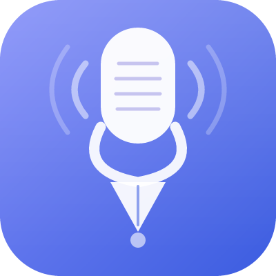

<div align="center">
  
  <h1>Samba</h1>
  <p><em>Your silent scribe — listens to every meeting, so you don't have to take notes.</em></p>

  
  
  
  
  
</div>


## Features

| Feature | Description |
|---|---|
| **Live Transcription** | Real-time speech-to-text using [mlx-whisper](https://github.com/ml-explore/mlx-examples) (Apple Silicon optimised) |
| **Speaker Labels** | Automatically distinguishes between **You** and **Meeting** using per-segment audio energy comparison |
| **AI Summarisation** | One-click or auto-summary after every meeting via local [Ollama](https://ollama.com) LLM |
| **Action Items** | Strict extraction — only items actually discussed, never fabricated |
| **Todo List** | Per-meeting todo list; completed meetings auto-wipe when all items are checked |
| **Notion Integration** | Push full transcript + summary + action items to a Notion page in one click |
| **Auto-detection** | Detects Zoom / Teams / Webex / Chime processes and starts recording automatically |
| **Persistent Settings** | Notes directory, Ollama model, Notion credentials — all saved locally |
| **Save as Markdown** | Export full meeting notes to a markdown file in your chosen directory |
| **Native macOS App** | Runs as a `.app` bundle with a custom icon |

---

## Screenshots

> Transcript tab with live speaker labels

```
[09:42:11] You: ok so the plan is to ship the dashboard by Friday
[09:42:18] Meeting: that works, I can handle the backend part
[09:42:25] You: great, lets sync again Thursday morning
```

---

## Architecture

```
┌─────────────────────────────────────────────────┐
│                  macOS Audio                     │
│                                                  │
│  System Output → Multi-Output Device             │
│                    ├── Speakers / Headphones     │
│                    └── BlackHole 2ch  ──────────┐│
│  Microphone ────────────────────────────────────┤│
└─────────────────────────────────────────────────┘│
                                                   ││
                    ┌──────────────────────────────┘│
                    │  sounddevice streams          │
                    ▼                               │
         ┌──────────────────┐                       │
         │  10s audio chunk │◄──────────────────────┘
         │  (mixed bh+mic)  │
         └────────┬─────────┘
                  │
                  ▼
         ┌──────────────────┐      per-segment RMS comparison
         │   mlx-whisper    │─────────────────────────────────►  You / Meeting label
         │ large-v3-turbo   │
         └────────┬─────────┘
                  │ transcript segments
                  ▼
         ┌──────────────────┐
         │   Flask backend  │
         │    (app.py)      │
         └──┬───────┬───────┘
            │       │
     ┌──────┘       └──────────┐
     ▼                         ▼
┌─────────┐             ┌────────────┐
│  Ollama │             │  Notion API│
│ llama3.2│             │            │
└────┬────┘             └─────┬──────┘
     │ summary +               │ page with
     │ action items            │ transcript
     ▼                         ▼
┌─────────────────────────────────────┐
│         pywebview UI                │
│  Transcript │ Summary │ Actions │ Todos │
└─────────────────────────────────────┘
```

---

## Prerequisites

### Required

| Tool | Purpose | Install |
|---|---|---|
| **Python 3.10+** | Runtime | [python.org](https://www.python.org) or `brew install python` |
| **BlackHole 2ch** | Virtual audio driver to capture system output | [existential.audio/blackhole](https://existential.audio/blackhole/) |
| **Ollama** | Local LLM server for summarisation | [ollama.com](https://ollama.com) |
| **macOS (Apple Silicon)** | Required for mlx-whisper GPU acceleration | M1/M2/M3/M4 Mac |

### macOS Audio Setup (one-time)

1. Install **BlackHole 2ch**
2. Open **Audio MIDI Setup** → click `+` → **Create Multi-Output Device**
3. Check both **BlackHole 2ch** and your speakers/headphones
4. Set this Multi-Output Device as your **System Output** in System Settings → Sound

> This routes audio to your speakers *and* BlackHole simultaneously, so Samba can hear everything without muting you.

---

## Installation

### Option 1 — Download the app (easiest)

1. Go to the [Releases](https://github.com/YOUR_USERNAME/samba/releases) page
2. Download `Samba.dmg` from the latest release
3. Open the `.dmg` and drag **Samba.app** into `/Applications`
4. **First launch:** right-click → **Open** → click Open in the dialog

> The right-click → Open step is required because Samba is not notarized with an Apple Developer certificate. macOS Gatekeeper will block a normal double-click the first time. After that, it opens like any other app.

### Option 2 — Build from source

**Prerequisites:** Python 3.10+, BlackHole 2ch, Ollama

```bash
git clone https://github.com/YOUR_USERNAME/samba.git
cd samba
chmod +x install.sh
./install.sh
```

The installer will:
- Verify BlackHole and Ollama are installed
- Install all Python dependencies
- Pull the `llama3.2` Ollama model
- Pre-download the Whisper model
- Install `Samba.app` to `/Applications`

### Option 3 — Run without building

```bash
git clone https://github.com/YOUR_USERNAME/samba.git
cd samba
pip install -r requirements.txt
python app.py
```

---

## Running

**Via the app:**
```
/Applications/Samba.app
```

**Via terminal (development):**
```bash
python app.py
```

The app opens a native window at `http://127.0.0.1:5000`.

---

## Configuration

All settings are accessible via the **gear icon** in the top-right corner of the app.

| Setting | Default | Description |
|---|---|---|
| Notes Directory | `~/Documents/samba_notes` | Where `.md` files are saved |
| Ollama Model | `llama3.2` | Any model pulled via `ollama pull <model>` |
| Notion Token | *(empty)* | Internal integration token from notion.so/my-integrations |
| Notion Parent Page ID | *(empty)* | ID of the Notion page to push notes into |
| Auto-start | Off | Auto-start recording when Zoom/Teams is detected |

Settings are saved to `settings.json` (gitignored).

---

## Usage

1. **Start a meeting** — click **Start Recording** (or enable Auto-detect)
2. **Talk** — watch the transcript populate in real-time with speaker labels
3. **Stop** — click **Stop Recording**; summary generates automatically
4. **Review** — check **Summary** and **Actions** tabs
5. **Export** — Copy to clipboard, push to Notion, or save as Markdown

---

## Project Structure

```
samba/
├── app.py                  # Flask backend — audio, transcription, Ollama, Notion
├── templates/
│   └── index.html          # UI with 4 tabs: Transcript, Summary, Actions, Todos
├── static/
│   ├── js/app.js           # Frontend logic, polling, settings, todos
│   ├── css/style.css       # Styling, speaker colours, animations
│   └── logo.png            # App icon (400×400)
├── requirements.txt
├── install.sh              # Full installer for new machines
├── setup.py                # py2app config (reference only)
└── dist/
    └── Samba.app/          # macOS app bundle (shell-script launcher)
```

---

## Windows Compatibility

Samba is **macOS-only** currently. The blockers for Windows are:

| Component | macOS | Windows equivalent |
|---|---|---|
| **mlx-whisper** | Apple Silicon GPU | Replace with `faster-whisper` (CUDA/CPU) |
| **BlackHole** | Virtual audio driver | [VB-Audio Virtual Cable](https://vb-audio.com/Cable/) |
| **pbcopy** (clipboard) | macOS built-in | Replace with `pyperclip` |
| **pywebview** | Works cross-platform | Already compatible |
| **Ollama** | Works cross-platform | Already compatible |

A Windows port is feasible but not planned — PRs welcome.

---

## Notion Setup

Notion is optional. If you want to push meeting notes to Notion:

1. Go to [notion.so/my-integrations](https://www.notion.so/my-integrations) → **New integration**
2. Give it a name (e.g. "Samba"), set type to **Internal**, click Save
3. Copy the **Internal Integration Token** (starts with `secret_...`)
4. Open the Notion page you want notes pushed into
5. Click **⋯** (top-right) → **Connections** → search for your integration → click to connect
6. Copy the **Page ID** from the page URL:
   ```
   https://notion.so/My-Meeting-Notes-2e2e48cc793580619b08c5762548c69e
                                        ^^^^^^^^^^^^^^^^^^^^^^^^^^^^^^^^
                                        this is your Page ID
   ```
7. In Samba, click the **gear icon** → paste your token and page ID → Save

Once configured, the **Send to Notion** button will push the full transcript, summary, and action items as a new sub-page.

---

## Privacy

- **Everything runs locally.** Audio never leaves your machine.
- Transcription: on-device via mlx-whisper
- Summarisation: on-device via Ollama
- The only network call is the optional Notion push, which you initiate manually.

---

## License

© Akhil Sagaran Kasturi 2026

---

<div align="center">
  
  <br/>
  <sub>Built with ❤️ for people who hate taking meeting notes.</sub>
</div>
